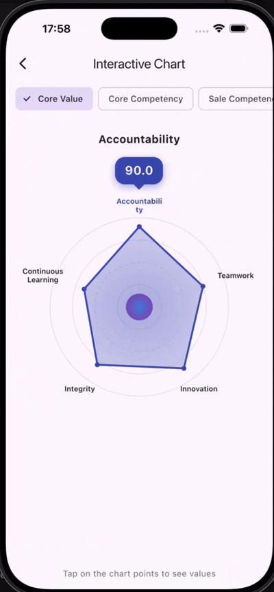
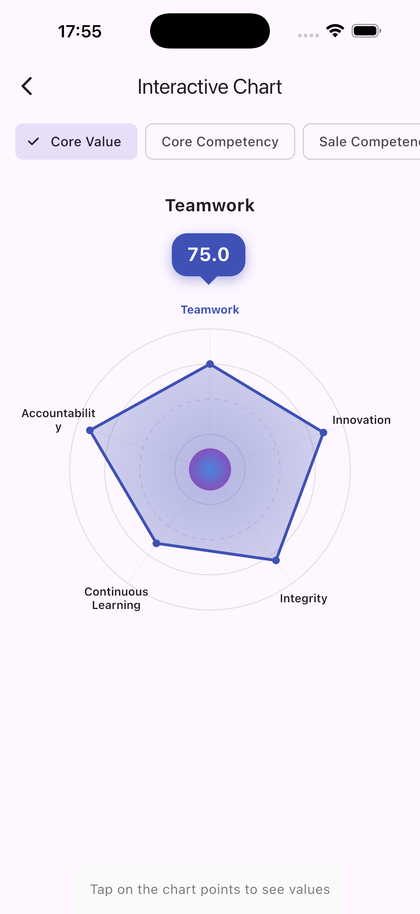
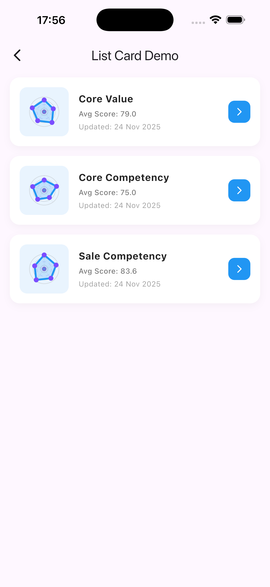
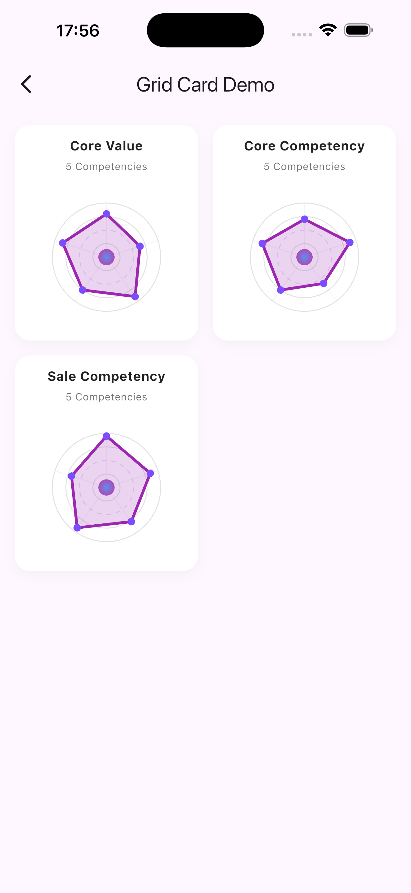
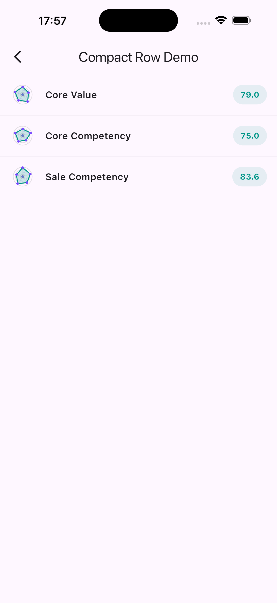

# LinSpiderMonkeyChart

A Flutter widget library for rendering interactive spider/radar charts. This library provides a flexible and customizable way to visualize multi-variable data in a radar chart format.



## Features

- **Spider Chart**: Customizable radar chart with support for multiple datasets.
- **Interactive**: Supports touch interactions, rotation, and selection.
- **Customizable**: Extensive theming options for colors, fonts, and styles.
- **Widgets**: Includes pre-built cards and list items for displaying charts in various layouts.

## Screenshots

|                   Interactive Chart                   |               List Card                |
| :---------------------------------------------------: | :------------------------------------: |
|  |  |

|               Grid Card                |                   Compact Row                    |
| :------------------------------------: | :----------------------------------------------: |
|  |  |

## Installation

Add this to your package's `pubspec.yaml` file:

```yaml
dependencies:
  lin_spider_monkey_chart: ^1.0.0
```

## Usage

### 1. Basic Spider Chart

The `SpiderChart` widget is the core component for rendering the radar chart.

```dart
import 'package:lin_spider_monkey_chart/lin_spider_monkey_chart.dart';

SpiderChart(
  // Labels for each dimension of the chart
  labels: ['Integrity', 'Learning', 'Accountability', 'Teamwork', 'Innovation'],
  // Data values corresponding to each label (must be same length as labels)
  data: [80, 65, 90, 75, 85],
  // Maximum value for the chart scale (default is 100)
  maxValue: 100,
  // Custom theme configuration
  theme: SpiderChartThemeData(
    dataLineColor: Colors.blue, // Color of the polygon outline
    dataFillColor: Colors.blue.withValues(alpha: 0.2), // Color of the polygon fill
    labelStyle: TextStyle(fontSize: 12, color: Colors.black87), // Style for labels
  ),
)
```

### 2. Interactive Spider Chart

The `InteractiveSpiderChart` adds interactivity, such as rotating the chart to focus on a selected point and showing a score bubble.

```dart
InteractiveSpiderChart(
  labels: ['A', 'B', 'C', 'D', 'E'],
  data: [80, 70, 90, 60, 85],
  maxValue: 100,
  // Size of the interactive area
  size: Size(300, 400),
  // Theme with interactive specific settings
  theme: SpiderChartThemeData(
    rotateToTop: true, // Rotate the selected point to the top
    rotationDuration: Duration(milliseconds: 800), // Animation duration
    showSelectedLabel: true, // Highlight the selected label
    bubbleOffset: 10, // Distance of the score bubble from the chart
  ),
)
```

### 3. Pre-built UI Widgets

The library comes with several pre-built widgets to easily integrate charts into your UI.

#### ChartListCard

A card widget suitable for lists, displaying a small chart alongside title and details.

```dart
ChartListCard(
  title: 'Performance Review',
  scoreText: 'Avg: 85%',
  dateText: 'Nov 24, 2025',
  labels: ['A', 'B', 'C', 'D', 'E'],
  data: [80, 70, 90, 60, 85],
  onTap: () {
    // Handle tap event
  },
  theme: SpiderChartThemeData(
    dataLineColor: Colors.teal,
    dataFillColor: Colors.teal.withValues(alpha: 0.2),
  ),
)
```

#### ChartGridCard

A card widget designed for grid layouts.

```dart
ChartGridCard(
  title: 'Sales Skills',
  subtitle: '5 Competencies',
  labels: ['Neg', 'Prod', 'Close', 'Cust', 'Prosp'],
  data: [95, 85, 78, 92, 68],
  onTap: () {
    // Handle tap event
  },
  theme: SpiderChartThemeData(
    dataLineColor: Colors.purple,
    dataFillColor: Colors.purple.withValues(alpha: 0.2),
  ),
)
```

#### ChartCompactRow

A compact row widget, useful for dense lists or summaries.

```dart
ChartCompactRow(
  title: 'Core Values',
  score: 79.0, // Displayed score
  labels: ['Int', 'Lrn', 'Acc', 'Team', 'Inn'],
  data: [80, 65, 90, 75, 85],
  onTap: () {
    // Handle tap event
  },
)
```

### 4. Theming

You can fully customize the look and feel using `SpiderChartThemeData`.

```dart
SpiderChartThemeData(
  // Grid and Axis lines
  gridLineColor: Colors.grey[300]!,
  gridDashedLineColor: Colors.grey[200]!,
  spokeLineColor: Colors.grey[300]!,

  // Data Polygon
  dataLineColor: Colors.blue,
  dataFillColor: Colors.blue.withValues(alpha: 0.2),
  strokeWidth: 3.0,

  // Points
  pointSize: 4.0,
  pointColor: Colors.blue,

  // Labels
  labelOffsetFromChart: 15.0, // Distance of labels from the chart
  labelStyle: TextStyle(color: Colors.black, fontSize: 10),
  selectedLabelStyle: TextStyle(color: Colors.blue, fontWeight: FontWeight.bold),

  // Interactivity
  rotateToTop: true,
  showSelectedLabel: true,
)
```
